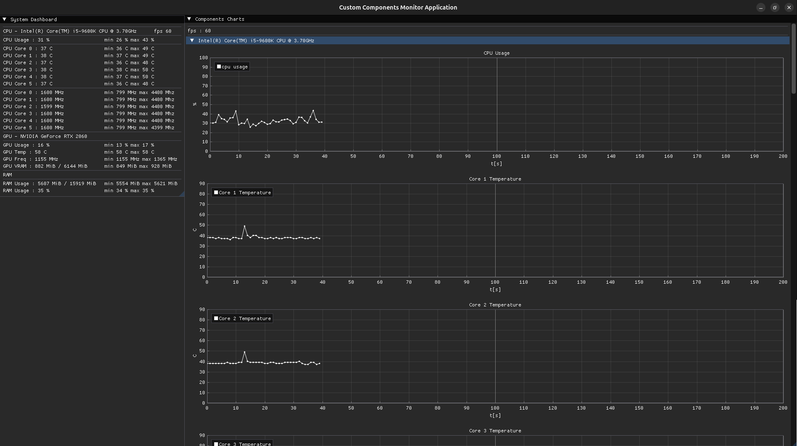
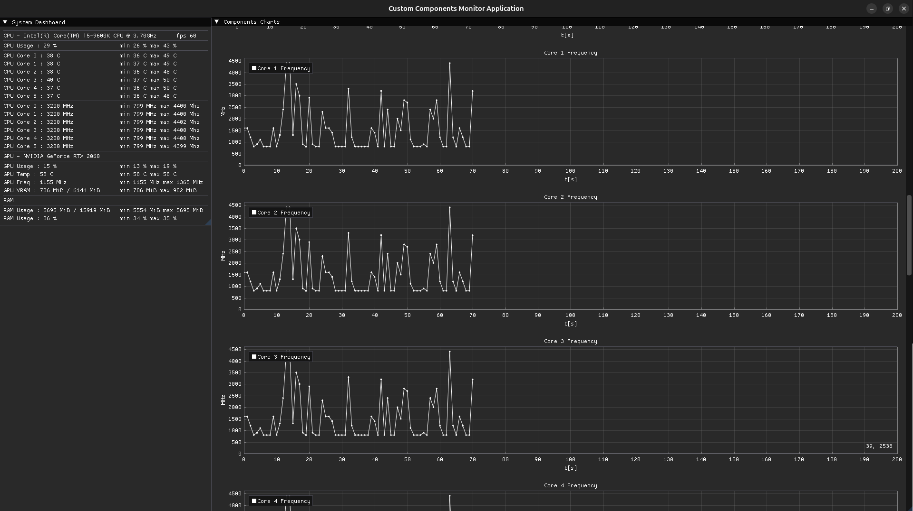
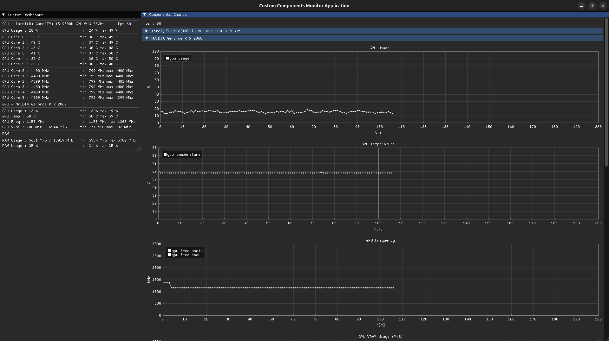
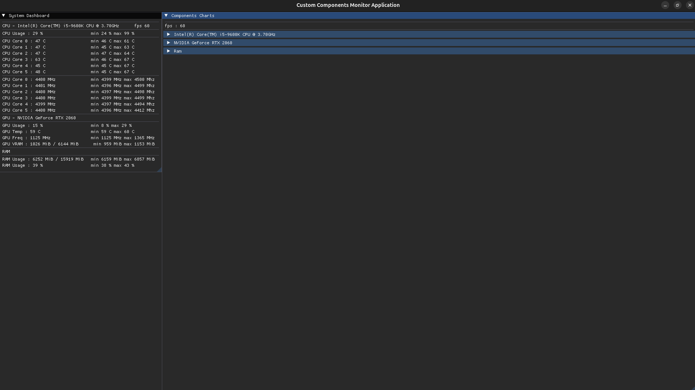
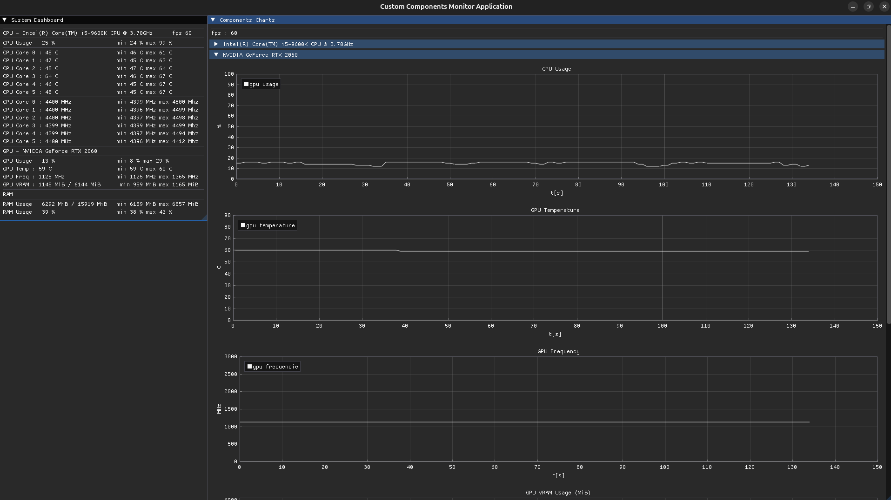
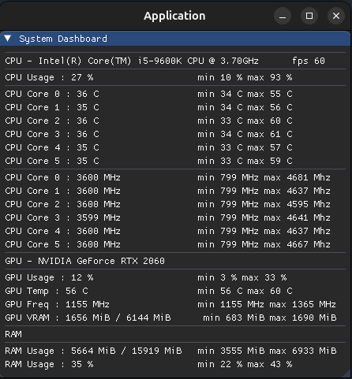

<h2>
Custom computer components monitor application. Working only with Intel CPU and Nvidia GPU only on linux os.
<h2>
<h3>
Created using ImGui with ImPlot for charts drawing. Also used nvml.h for GPU parameters and libsensors lib for CPU parameters. The rest of information is beeing retrieved from system files ( for example : /proc/meminfo ).
<h3>

    
    
    
    
    

<h2>
Small system dashboard designed for tracking computer components in real time. It is also useful in everyday computer usage. I'm using it personally for tracking extreme noted temperatures while overloading CPU/GPU and ram usage.
<h2>

    
    

