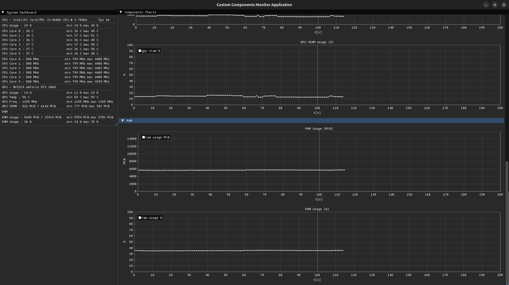

<h2>
Custom computer components monitor application. Working only with Intel CPU and Nvidia GPU on linux.
<h2>

    
    
    
    
    
    

<h2>
Small system dashboard designed for tracking computer components in real time. It is also useful in everyday computer usage. I'm using it personally for tracking extreme noted temperatures while overloading CPU/GPU and ram usage.
<h2>

    
    

